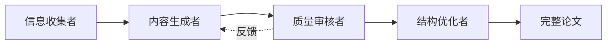

# 🌟 星海论文智能体

<div align="center">


**基于多模型协作的学术论文智能生成系统**

[快速开始](#-快速开始) • [功能特性](#-功能特性) • [系统架构](#-系统架构) • [使用指南](#-使用指南) • [API文档](#-api文档)

</div>

---

## 📖 项目简介

星海论文智能体是一个创新的学术论文生成系统，采用**多AI模型协作**架构，通过智能引导式表单收集研究信息，自动生成结构完整、逻辑严谨的学术论文。系统支持本地大模型（Ollama）和自定义API接入，提供优雅的毛玻璃UI界面和流畅的用户体验。

### ✨ 核心亮点

- 🤖 **多模型协作架构** - 4个专业AI角色分工协作（信息收集者、内容生成者、质量审核者、结构优化者）
- 📝 **智能信息收集** - 20+字段的引导式表单，精准捕获研究全貌
- 🎨 **极简毛玻璃UI** - 液态玻璃风格设计，沉浸式视觉体验
- 🔌 **灵活AI接入** - 支持Ollama本地服务和OpenAI兼容API
- 💾 **会话持久化** - 自动保存项目进度，支持随时恢复
- 📤 **多格式导出** - 支持Markdown和纯文本格式导出

---

## 🚀 快速开始

### 环境要求

- Python 3.8 或更高版本
- Ollama（可选，用于本地AI服务）
- 8GB+ 内存
- 现代浏览器（Chrome/Firefox/Safari/Edge）

### 一键启动

#### macOS / Linux

```bash
chmod +x start.sh
./start.sh
```

#### Windows

双击运行 `start.bat` 或在命令行执行：

```cmd
start.bat
```

### 手动安装

1. **克隆项目**

```bash
git clone <repository-url>
cd 星海论文智能体
```

2. **安装依赖**

```bash
pip install -r requirements.txt
```

3. **配置环境**

复制 `.env.example` 为 `.env` 并配置：

```bash
cp .env.example .env
```

编辑 `.env` 文件：

```env
# Flask服务配置
FLASK_PORT=5006
FLASK_DEBUG=True

# Ollama配置（本地AI服务）
OLLAMA_BASE_URL=http://localhost:11434
OLLAMA_MODEL=qwen2.5:7b

# 自定义API配置（可选）
CUSTOM_API_1_URL=https://api.openai.com/v1
CUSTOM_API_1_KEY=your-api-key-here
CUSTOM_API_1_MODEL=gpt-4
```

4. **启动服务**

```bash
python app.py
```

5. **访问应用**

浏览器打开：http://localhost:5006

---

## 🎯 功能特性

### 1️⃣ 智能表单收集

系统提供6大类信息收集模块，全面覆盖学术论文要素：

| 模块 | 字段数 | 必填项 | 说明 |
|------|--------|--------|------|
| 📌 基本信息 | 2 | 1 | 项目标题、用户ID |
| 🔬 研究主题与背景 | 5 | 3 | 研究主题、背景、目标、问题、期刊 |
| 📚 理论基础与文献 | 3 | 0 | 理论基础、相关研究、研究缺口 |
| 🔧 研究方法 | 5 | 3 | 研究设计、数据来源、分析方法 |
| 📊 研究结果 | 3 | 1 | 主要发现、数据呈现、关键指标 |
| 💡 讨论与结论 | 5 | 0 | 结果解释、理论贡献、实践启示 |

**总计：23个字段，8个必填项**

### 2️⃣ 多模型协作生成

四个专业AI角色分工协作，确保论文质量：



- **信息收集者** - 智能分析用户输入，识别缺失信息
- **内容生成者** - 基于收集信息生成各章节内容
- **质量审核者** - 审核内容准确性、逻辑性和学术规范
- **结构优化者** - 优化论文结构、改进表达和格式

### 3️⃣ 完整章节结构

自动生成标准学术论文的7大核心章节：

1. **Abstract (摘要)** - 研究背景、方法、结果和结论
2. **Introduction (引言)** - 研究背景、动机和目标
3. **Literature Review (文献综述)** - 相关研究和理论基础
4. **Methodology (研究方法)** - 研究设计、数据和分析方法
5. **Results (研究结果)** - 主要发现和数据呈现
6. **Discussion (讨论)** - 结果解释和理论贡献
7. **Conclusion (结论)** - 研究总结和未来方向

### 4️⃣ 会话管理

- ✅ 自动保存项目进度
- ✅ 多项目并行管理
- ✅ 一键删除项目
- ✅ 历史记录查看
- ✅ 实时状态跟踪

### 5️⃣ 导出功能

- 📄 **Markdown格式** - 保留完整格式，便于编辑
- 📝 **纯文本格式** - 兼容各类文本编辑器
- 🎯 自动命名：`{项目标题}_{时间戳}.{格式}`

---

## 🏗️ 系统架构

### 技术栈

#### 后端技术

- **Python 3.8+** - 核心开发语言
- **Flask** - Web框架
- **Flask-CORS** - 跨域支持
- **python-dotenv** - 环境变量管理

#### 前端技术

- **原生JavaScript (ES6+)** - 无框架依赖
- **CSS3** - 毛玻璃效果、动画
- **HTML5** - 语义化标签

#### AI服务

- **Ollama** - 本地大模型服务
- **OpenAI Compatible API** - 支持各类兼容接口

### 项目结构

```
星海论文智能体/
├── app.py                      # Flask主应用
├── ai_service.py               # AI服务管理
├── collaboration_engine.py     # 多模型协作引擎
├── conversation_manager.py     # 会话管理器
├── paper_generator.py          # 论文生成器
├── prompt_templates.py         # 提示词模板库
├── config.yaml                 # 系统配置
├── requirements.txt            # Python依赖
├── .env.example               # 环境变量示例
├── start.sh                   # macOS/Linux启动脚本
├── start.bat                  # Windows启动脚本
├── static/                    # 静态资源
│   ├── 01.png                # 背景图片
│   ├── css/
│   │   └── style.css         # 毛玻璃样式
│   └── js/
│       └── app.js            # 前端逻辑
├── templates/                 # HTML模板
│   └── index.html            # 主页面
└── data/                      # 数据存储
    └── sessions/             # 会话持久化
```

### 核心模块

#### 1. AI服务层 (`ai_service.py`)

统一管理多种AI服务接入：

```python
# 支持的服务类型
- Ollama本地服务
- 自定义OpenAI兼容API
- 多服务负载均衡
```

#### 2. 协作引擎 (`collaboration_engine.py`)

实现多模型角色分工：

```python
角色映射:
  - information_collector → 信息收集者
  - content_generator → 内容生成者
  - quality_reviewer → 质量审核者
  - structure_optimizer → 结构优化者
```

#### 3. 会话管理 (`conversation_manager.py`)

提供完整的会话生命周期管理：

```python
功能:
  - create_session() - 创建新会话
  - get_session() - 获取会话详情
  - add_message() - 添加对话消息
  - update_context() - 更新上下文
  - delete_session() - 删除会话
  - list_sessions() - 列出所有会话
```

#### 4. 论文生成器 (`paper_generator.py`)

核心论文生成逻辑：

```python
流程:
  1. 收集研究信息
  2. 多模型协作生成
  3. 质量审核优化
  4. 结构整理输出
```

---

## 📘 使用指南

### 基础使用流程

#### 步骤1：创建新项目

1. 点击左上角 **"新建论文项目"** 按钮
2. 在弹出的表单中填写研究信息
3. 必填字段标记有红色 `*` 号
4. 点击 **"确认并生成"** 开始生成

#### 步骤2：等待生成

- 系统显示 **"正在生成论文，请稍候（约 3-10 分钟）..."**
- 生成时间取决于模型性能和内容复杂度
- 可在左侧会话列表查看项目状态

#### 步骤3：查看论文

- 生成完成后，右侧预览区自动显示论文内容
- 包含7大标准章节
- 左侧对话区显示生成日志

#### 步骤4：导出论文

点击右上角导出按钮：
- **导出 Markdown** - 适合进一步编辑
- **导出 TXT** - 纯文本格式

#### 步骤5：管理项目

- **查看历史** - 左侧列表点击项目即可加载
- **删除项目** - 点击项目右侧 🗑️ 按钮

### 高级功能

#### 自定义AI服务

编辑 `config.yaml` 添加自定义API：

```yaml
ai_services:
  custom_apis:
    - name: "GPT-4"
      url: "https://api.openai.com/v1"
      api_key: "${CUSTOM_API_1_KEY}"
      model: "gpt-4"
      
    - name: "Claude"
      url: "https://api.anthropic.com/v1"
      api_key: "${CUSTOM_API_2_KEY}"
      model: "claude-3-opus"
```

#### 角色服务映射

在 `config.yaml` 中自定义角色使用的AI服务：

```yaml
collaboration:
  role_service_mapping:
    information_collector: "ollama"
    content_generator: "custom_1"
    quality_reviewer: "custom_2"
    structure_optimizer: "ollama"
```

---

## 🔌 API文档

### RESTful API端点

#### 1. 健康检查

```http
GET /api/health
```

**响应示例：**
```json
{
  "status": "healthy",
  "timestamp": "2024-01-01T12:00:00",
  "ai_services": ["ollama", "custom_1"],
  "ai_services_count": 2
}
```

#### 2. 创建项目

```http
POST /api/paper/start
Content-Type: application/json

{
  "user_id": "default_user",
  "title": "机器学习在医疗诊断中的应用",
  "collected_info": {
    "研究主题": "深度学习辅助癌症诊断",
    "研究背景": "...",
    ...
  },
  "skip_conversation": true
}
```

**响应示例：**
```json
{
  "success": true,
  "data": {
    "session_id": "default_user_20240101_120000",
    "stage": "generating",
    "message": "项目创建成功，即将开始生成论文"
  }
}
```

#### 3. 生成论文

```http
POST /api/paper/generate
Content-Type: application/json

{
  "session_id": "default_user_20240101_120000"
}
```

**响应示例：**
```json
{
  "success": true,
  "data": {
    "paper_content": {
      "abstract": "...",
      "introduction": "...",
      ...
    },
    "session_id": "default_user_20240101_120000"
  }
}
```

#### 4. 获取会话列表

```http
GET /api/paper/sessions?user_id=default_user
```

**响应示例：**
```json
{
  "success": true,
  "data": [
    {
      "session_id": "default_user_20240101_120000",
      "user_id": "default_user",
      "title": "机器学习在医疗诊断中的应用",
      "status": "completed",
      "created_at": "2024-01-01T12:00:00",
      "updated_at": "2024-01-01T12:10:00",
      "message_count": 5
    }
  ]
}
```

#### 5. 删除会话

```http
DELETE /api/paper/session/{session_id}
```

**响应示例：**
```json
{
  "success": true,
  "message": "会话已删除"
}
```

#### 6. 导出论文

```http
GET /api/paper/export/{session_id}?format=markdown
```

**参数：**
- `format`: `markdown` 或 `text`

**响应：** 文件下载

### 完整API列表

| 端点 | 方法 | 说明 |
|------|------|------|
| `/api/health` | GET | 健康检查 |
| `/api/services` | GET | 获取AI服务列表 |
| `/api/paper/start` | POST | 创建新项目 |
| `/api/paper/generate` | POST | 生成完整论文 |
| `/api/paper/message` | POST | 发送用户消息 |
| `/api/paper/session/{id}` | GET | 获取会话详情 |
| `/api/paper/session/{id}` | DELETE | 删除会话 |
| `/api/paper/sessions` | GET | 获取会话列表 |
| `/api/paper/export/{id}` | GET | 导出论文 |
| `/api/paper/regenerate` | POST | 重新生成章节 |

---

## ⚙️ 配置说明

### 环境变量 (`.env`)

```env
# Flask服务配置
FLASK_PORT=5006              # 服务端口
FLASK_DEBUG=True             # 调试模式

# Ollama配置
OLLAMA_BASE_URL=http://localhost:11434
OLLAMA_MODEL=qwen2.5:7b      # 使用的模型

# 自定义API配置（示例）
CUSTOM_API_1_URL=https://api.openai.com/v1
CUSTOM_API_1_KEY=sk-xxxxx
CUSTOM_API_1_MODEL=gpt-4

CUSTOM_API_2_URL=https://api.anthropic.com/v1
CUSTOM_API_2_KEY=sk-ant-xxxxx
CUSTOM_API_2_MODEL=claude-3-opus
```

### 系统配置 (`config.yaml`)

```yaml
ai_services:
  # Ollama本地服务
  ollama:
    base_url: "${OLLAMA_BASE_URL}"
    model: "${OLLAMA_MODEL}"
    
  # 自定义API服务
  custom_apis:
    - name: "GPT-4"
      url: "${CUSTOM_API_1_URL}"
      api_key: "${CUSTOM_API_1_KEY}"
      model: "${CUSTOM_API_1_MODEL}"

# 多模型协作配置
collaboration:
  role_service_mapping:
    information_collector: "ollama"
    content_generator: "ollama"
    quality_reviewer: "ollama"
    structure_optimizer: "ollama"
```

---

## 🎨 UI设计

### 设计理念

**极简 + 液态玻璃风格**

- 🎯 **极简主义** - 去除一切多余元素，专注核心功能
- 💎 **液态玻璃** - 高斯模糊 + 半透明 + 柔和阴影
- 🌈 **沉浸体验** - 背景图透过界面，视觉层次丰富
- ✨ **流畅动画** - Cubic-bezier缓动，自然平滑

### 核心样式特性

```css
/* 毛玻璃效果 */
backdrop-filter: blur(30px) saturate(150%);
background: rgba(255, 255, 255, 0.05);
border: 1px solid rgba(255, 255, 255, 0.1);

/* 圆角与阴影 */
border-radius: 24px;
box-shadow: 0 8px 32px 0 rgba(0, 0, 0, 0.3);

/* 流畅动画 */
transition: all 0.3s cubic-bezier(0.4, 0, 0.2, 1);
```

### 色彩系统

- **主色** - 紫蓝色 `rgba(99, 102, 241, 0.6)`
- **成功** - 翠绿色 `rgba(52, 211, 153, 0.6)`
- **警告** - 琥珀色 `rgba(251, 191, 36, 0.9)`
- **危险** - 红色 `rgba(239, 68, 68, 0.4)`
- **文字** - 白色系多层透明度 (95% / 70% / 50%)

---

## 🔧 常见问题

### Q1: Ollama连接失败？

**解决方案：**

1. 确认Ollama服务已启动：
```bash
ollama serve
```

2. 检查端口是否正确（默认11434）

3. 下载所需模型：
```bash
ollama pull qwen2.5:7b
```

### Q2: 论文生成速度慢？

**优化建议：**

1. 使用更小的模型（如 `qwen2.5:3b`）
2. 升级硬件配置（CPU/GPU/内存）
3. 使用云端API服务代替本地模型

### Q3: 如何更换AI模型？

**步骤：**

1. 编辑 `.env` 文件：
```env
OLLAMA_MODEL=qwen2.5:14b  # 更换为其他模型
```

2. 重启服务：
```bash
./start.sh  # 或 start.bat
```

### Q4: 端口被占用？

**解决方案：**

修改 `.env` 中的端口：
```env
FLASK_PORT=5007  # 改为其他端口
```

### Q5: 背景图不显示？

**检查：**

1. 确认图片文件存在：`static/01.png`
2. 浏览器强制刷新：`Ctrl+Shift+R` (Windows) 或 `Cmd+Shift+R` (Mac)

---

## 🤝 贡献指南

欢迎提交问题和Pull Request！

### 开发流程

1. Fork本仓库
2. 创建特性分支：`git checkout -b feature/AmazingFeature`
3. 提交更改：`git commit -m 'Add some AmazingFeature'`
4. 推送分支：`git push origin feature/AmazingFeature`
5. 提交Pull Request

### 代码规范

- Python代码遵循 PEP 8
- JavaScript使用ES6+标准
- 提交信息使用语义化格式

---

## 📄 许可证

本项目采用 MIT 许可证。详见 [LICENSE](LICENSE) 文件。

---

## 🙏 致谢

- [Flask](https://flask.palletsprojects.com/) - Python Web框架
- [Ollama](https://ollama.ai/) - 本地大模型服务
- [OpenAI](https://openai.com/) - API标准参考
- 所有贡献者和使用者

---

## 📞 联系方式

- 项目主页：[GitHub Repository](#)
- 问题反馈：[Issues](#)
- 邮箱：your-email@example.com

---

<div align="center">

**⭐ 如果这个项目对您有帮助，请给个Star支持一下！**

Made with ❤️ by 星海团队

</div>
